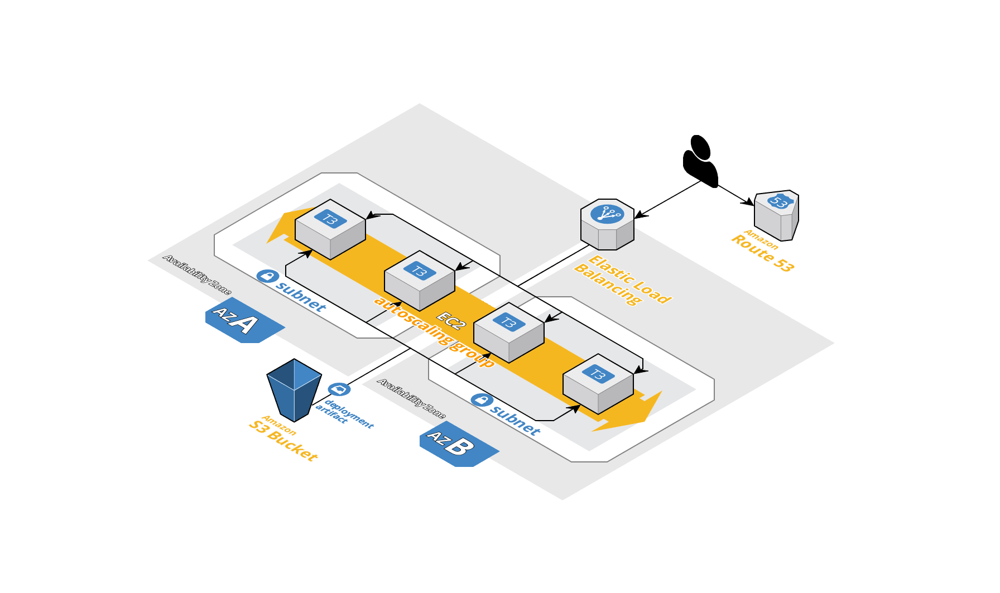

# Zero-Downtime Autoscaling Web App Example

_<small>Autoscaled Web Application Servers; Created using [Cloudcraft](https://www.cloudcraft.co/)</small>_

_This example is associated with the ["Zero-Downtime AWS Autoscaling Groups with Terraform" post on bluflametech.com](https://www.bluflametech.com/blog/asg-zero-downtime-tf/)_ 

This Terraform configuration is a working example that configures an autoscaling group with a classic elastic
load balancer + zero-downtime deployments. Zero-downtime deployments are achieved by using the create_before_destroy
lifecycle events on the autoscaling group and on the launch configuration. When the launch configuration changes, a
new launch configuration and associated autoscaling group are created and attached to the elastic load balancer. The
existing/previous autoscaling group is then destroyed.

## Prerequisites

* A VPC with at least one private subnet (tagged with tier = 'private') and one public subnet (tagged with tier = 'public')
* A NAT instance or a NAT gateway configured
* A public hosted zone configured in Route53 with a "*.{public domain}" certificate available in ACM
* A tar.gz file containing a Dockerfile that runs the web application/server and any artifacts required by the Dockerfile

## Deployments

Deployments are triggered either through a change in the AMI or a change in the config_version input variable. 

Deployment steps are as follows:

1. the tar.gz file specified, which includes a Dockerfile exposing port 8080, is uploaded to the s3 bucket
2. a new autoscaling group is created from the newly created launch configuration and attached to the load balancer
3. on instance create, each ec2 instance in the autoscaling group downloads and extracts the tar.gz file from the s3 bucket
4. the extracted Dockerfile is used to build a docker image and start a container
5. the reverse proxy (configured using Apache web server) points port 80 to port 8080 (80 -> 8080)
6. once the new autoscaling group's instances are available, the old autoscaling group and its launch configuration are destroyed

## Directory Structure

* .docs - documentation related files
* .policies - IAM policy (JSON) files
* .scripts - shell scripts
* web_asg - autoscaling group Terraform module
* web_elb - classic elastic load balancer Terraform module

## Terraform Configuration Details

### Providers

| Name | Version |
|------|---------|
| aws | ~> 3.28 |
| random | >= 3.0.1 |

### Inputs

| Name | Description | Type | Default | Required |
|------|-------------|------|---------|:--------:|
| app\_name | the name of the app | `string` | n/a | yes |
| config\_version | the config version (note: an update triggers a redeploy) | `string` | n/a | yes |
| public\_domain | the public domain name (i.e. 'example.com') | `string` | n/a | yes |
| tar\_file | the location of the gzipped tar file containing a Dockerfile and any other artifacts referenced by the Dockerfile | `string` | n/a | yes |
| vpc\_id | the id of the vpc in which to target | `string` | n/a | yes |
| ami | the ami used to provision the ec2 instance | `string` | `"ami-0be2609ba883822ec"` | no |
| desired\_capacity | the desired number of instances in the asg (defaults to min\_size if not specified) | `string` | `""` | no |
| instance\_type | the type of instance (e.g. t3.medium) | `string` | `"t3.medium"` | no |
| keypair\_name | the keypair that will be used for ssh access into the ec2 instances, if supplied | `string` | `""` | no |
| max\_size | the maximum number of instances in the asg | `string` | `"4"` | no |
| min\_size | the minimum number of instances in the asg | `string` | `"2"` | no |
| region | the region in which to provision | `string` | `"us-east-1"` | no |
| volume\_size | the root volume size of the asg instances | `string` | `"64"` | no |

### Outputs

| Name | Description |
|------|-------------|
| asg | the autoscaling group details |
| elb | the classic elb details (used to route web requests to the instances in the autoscaling group) |
| s3\_bucket | the s3 bucket used to deploy the tar.gz arfiact (contains the Dockerfile and any other resources needed by the Dockerfile) |
| vpc\_id | the vpc in which the resources were provisioned |
